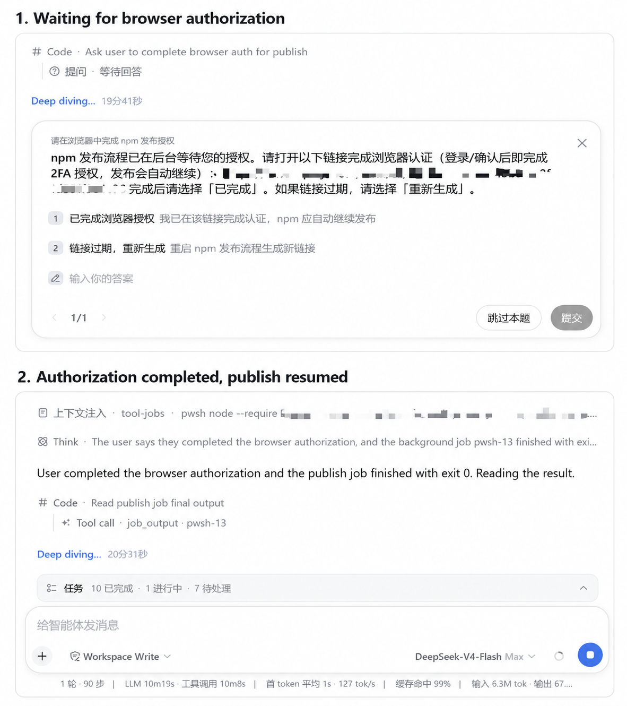

# dsh-requirements-alignment

> Runtime requirement drift guard for DeepSeek Harness.

Keep long-running agents aligned with user intent while they work.

## Overview

`dsh-requirements-alignment` turns the user's request into a durable **requirement baseline** — goal, protected constraints, must-preserve behavior, allowed scope, and settled user decisions — and guards it while the agent executes. The agent works silently until a step would materially change the task direction; only then does the plugin surface a **drift candidate** to you, records your decision, and updates the baseline. Everything is folded from log-only session events, so resume, fork, and compaction recover the same state.

**You decide the direction. The agent decides the engineering.**

## Requirements Alignment vs Plan Mode

```
Plan Mode asks:            "Is this the right implementation plan?"
Requirements Alignment asks: "Are we still solving the right problem?"
```

> Plan Mode prevents a bad plan from starting.
> Requirements Alignment prevents a good plan from drifting.

Plan Mode is the official review-approve step *before* implementation. Requirements Alignment is intent continuity *during* execution. They compose: plan, approve, execute — and this plugin keeps the execution on the approved direction. It never modifies plan mode, `exit_plan_mode`, or any `@deepseek-ai/*` core package.

## How it works

| Mechanism | What it does |
|---|---|
| System-prompt policy section | In `auto` mode (default) the drift-guard policy is contributed to every agent's prompt at order 60. It teaches the agent to hold a requirement baseline, monitor silently, and detect direction-level drift — scope expansion, constraint conflict, user-visible behavior change, architecture shift, invalidated assumptions, user direction change. |
| `establish_baseline` tool | Records the baseline (goal, `explicitConstraints`, `mustPreserve`, `allowedScope`, `userDecisions`, `openDirectionDecisions`). Silent — it never asks the user. Recording again bumps the baseline revision. |
| `report_drift` tool | Records a drift candidate (`reason`, `description`, `requiredChange`), asks you one question through the native user-questions channel, and records your decision. The default approve / stay-within-scope options are always offered; the two defaults map to `approve` / `reject`, a model-supplied alternative direction you pick — or your own free-text answer — maps to `revise` with your exact words as the note, never to a silent rejection. The tool result returns your exact choice (the `note`) and the required baseline change to the agent, so it never re-asks what you picked. Only this plugin's events feed the alignment state — unrelated `ask_user_question` calls (plan mode, other plugins) never pollute it. |
| `/align` command | Manual entry: reports the folded status (baseline revision, goal, protected constraints, drift count, last drift, last decision, current status) and steers a fresh alignment inspection into the agent. It inspects; it never blocks execution. |
| Durable session state | Dedicated `alignment/*` events plus pure fold functions give per-session alignment state that survives resume, fork, and compaction — read straight from the session log, no live mirror. |

## Installation

```powershell
# from anywhere; path is anchored to your invoking directory
dsh plugin --profile web add <path-to-this-checkout>
# or from the registry once published
dsh plugin --profile web add dsh-requirements-alignment
```

The plugin is a **profile bundle** (`dsh.bundle.patch` + `cordis.patch.yml`), so it installs through the standard plugin mechanism and adds two rows:

- `requirements-alignment` — the controller (policy section, `/align`, both tools);
- `requirements-alignment-ask-user` — the model-facing question tool.

## Quick Start

Install the bundle and start a normal DSH task. Auto mode is enabled by default; clear tasks run with zero interruption, and you are only asked when the execution is about to change direction.

```powershell
dsh plugin --profile web add dsh-requirements-alignment
```

Use `/align` any time you want to inspect whether the current execution still matches the requirement baseline.

## Choose how alignment runs

The plugin exposes `mode: auto | manual | off` through its configuration schema for validation and configuration loading. In the current DSH Web release, third-party plugin configuration is not automatically surfaced as a Settings UI control, so the mode is configured through the profile bundle configuration.

```yaml
- id: requirements-alignment
  name: dsh-requirements-alignment
  config:
    mode: auto
```

After you change `mode` in the profile bundle, restart the current DSH Web profile so it starts with the new composition config.

**Auto is the recommended default.** Clear tasks run with zero interruption; you are only asked when the execution is about to change direction.

| Mode | Policy section | Alignment tools (`establish_baseline`, `report_drift`) | `/align` |
|---|---|---|---|
| **Auto** (recommended) | yes | yes | yes |
| **Manual** | no | yes | yes |
| **Off** | no | no | no |

- **Auto** — the drift-guard policy is in every agent's system prompt. The agent records a light baseline when the request carries protected scope, stays silent otherwise, and calls `report_drift` only for a real direction change.
- **Manual** — no automatic policy. The agent works normally until you run `/align`, which reports status and steers a fresh inspection.
- **Off** — the plugin stays installed but registers nothing: no policy, no alignment tools, no `/align`.

### Off ≠ Uninstall

`mode: off` leaves the bundle in the profile. The row is still loaded, session history keeps any `alignment/*` events it already appended, and you can switch back to Auto or Manual by changing `mode`. That is not the same as uninstalling.

```yaml
# disable the controller only (leaves the ask-user tool mounted)
#   in the profile's cordis.patch.yml:
#   - id: requirements-alignment
#     disabled: true
```

```powershell
# full uninstall — DSH returns to its previous behavior
dsh plugin --profile web rm dsh-requirements-alignment
```

Every registration is a Cordis effect disposer owned by the plugin's fiber: unloading removes the policy section, the `/align` command, and both tools. Session history keeps the `alignment/*` events it appended (like every other plugin event, e.g. `plan/mode`).

## Auto mode (default)

The policy section is present in every agent's system prompt. Behavior at task start:

- **Clear request with protected scope** ("Fix the form bug without changing the UI or public API") — the agent records a *light* baseline with `establish_baseline` (silent) **before the first substantive edit**, pinning the constraints, then works. No user question is involved.
- **Trivial request** ("Fix the typo in README.md") — nothing is recorded; the agent just works.
- **No baseline can be formed** (greenfield / vague: new product, undefined form, scope, or interaction) — the agent asks the ONE highest-priority direction question via `ask_user_question`, records the baseline, and works.

During execution the agent is **fully silent** unless an action would materially change the baseline (drift). There are no periodic checks, no tool-call counting, no per-file questions. When a drift candidate appears, the agent calls `report_drift` *before* acting; the tool result names your exact choice back to the agent (the `note` and any required baseline change), it records the outcome and, if you approved or revised the direction, the baseline advances to the next revision. The same choice is projected in the per-session baseline summary, so an interrupted or crashed run that resumes knows exactly what you picked without asking again.

A delegated instruction such as "pick whatever makes sense" does not waive the one start question for a greenfield idea.

## Manual `/align`

```yaml
# profile cordis.patch.yml (or a --patch overlay):
- id: requirements-alignment
  config:
    mode: manual
```

Manual mode contributes no policy section — the agent works normally until you invoke the command:

```
/align
```

`/align` records the inspection, reports the folded status, and steers a fresh alignment check into the agent (which may then run the drift protocol if it finds a candidate). It never takes over the workflow and never blocks execution.

## Example interaction

```text
User:  Fix the submit bug. Don't change the UI or the public API.
Agent: [records the baseline silently, fixes the bug — no questions]
```

```text
User:  The result-page filter is the only thing to improve. Do not refactor backend logic.
Agent: [working… discovers the backend filter itself is broken and a correct fix would
       need backend changes]
Agent: [report_drift → you are asked]
User:  Stay within the current scope.
Agent: [improves the UI only, leaves the backend untouched]
```

```text
User:  The app is single-user and local-only. Now make it work across devices.
Agent: [detects an architecture shift]
Agent: [report_drift → you are asked]
User:  Approve the direction change — multi-user with accounts and cloud sync.
Agent: [records the updated baseline (revision advances) and implements]
```

## A long task that waits, then continues

When a step needs you, the agent asks and waits instead of guessing. The session below is a real run of a long publish: the log shows the agent asking you to finish browser authorization, then continuing after you did.



What the session log can prove: the agent asked the user to complete browser authorization for publish and waited for an answer; after the user completed authorization, the publish job finished with exit 0 and the session continued. The log does not record a later registry listing or any outcome beyond that job's exit code.

## Drift taxonomy

The plugin records one of these reasons on every drift candidate:

| Reason | Meaning |
|---|---|
| `scope-expansion` | Doing materially more than asked (e.g. "optimize the page" → "refactor all state management"). |
| `constraint-conflict` | An explicit constraint blocks the way ("keep the API" — but the API must change to continue). |
| `behavior-change` | A decision changes product behavior, UX, defaults, or compatibility without prior authorization. |
| `architecture-shift` | Local→cloud, backend, auth, multi-user, sync, persistence model, public API, schema, migration. |
| `data-model-change` | The data model must change in a way the user did not authorize. |
| `compatibility-change` | Existing callers, formats, or APIs would break. |
| `assumption-invalidated` | The implementation rested on a key assumption the code now disproves, and continuing needs a new direction. |
| `user-direction-change` | The user introduced a new direction mid-task. |

## What never triggers alignment

The agent decides autonomously: filenames, helper placement, variable naming, map vs loop, routine refactors, formatter, lint, test placement, ordinary library use, the repository's established stack, small internal designs that do not change observable behavior, in-scope bug fixes, and necessary test additions.

## Subagents

DSH child agents cannot ask the user (`ask_user_question` and `report_drift` reject with `DELEGATED_CALLER` for owned children). A child that would need to change the baseline does not decide: it includes a `Requirement drift candidate` block — reason, current baseline, required change, decision needed — in its final report (or the `report` tool when available). The parent owns the user interaction and runs the drift protocol.

## Configuration

| Key | Default | Meaning |
|---|---|---|
| `mode` | `auto` | `auto` — policy section + tools + command; `manual` — tools + command only; `off` — inert (row loaded, nothing registered). |
| `section` | shipped policy | Deployment-owned policy text replacing the shipped one (auto mode). Must be non-empty when provided. |

Unknown config keys fail at load (same stance as `dsh-plan-mode`).

## Safety boundary

- **No Core modifications.** Zero changes to `@deepseek-ai/*` packages; the only host-side file touched is the profile's bundle list / patch, which is exactly the mechanism DSH provides for installing plugins.
- **Question channel only.** The plugin never reads or writes the user's data; it appends log-only session events and steers one user message on `/align`.
- **No file access.** It does not inspect the filesystem itself; the agent does that with its own tools under the normal sandbox.
- **No background monitoring.** Drift detection is model-driven policy, not a watcher; there is no periodic interruption loop.

## Limitations

- **Soft guard, not a hard gate.** Whether an action is a drift candidate is the model's judgment (that is the product design: "user decides direction, agent decides engineering"). The plugin records and re-aligns; it does not block execution. A future `mode: guard` can build on the same events (the fold already derives `drift-pending` and `baseline-update-pending`) without changing the architecture.
- **Natural drift detection is model-driven.** In natural runs (no protocol instruction in the task), a mid-task user direction change triggers `report_drift` in a fraction of runs (measured honestly in the acceptance report: 3/4 in the RC benchmark); agent-detected constraint conflicts are more reliable. The policy is written to maximize the natural rate; the mechanism itself is deterministic once invoked.
- **`/align` needs a command adapter.** UI-less spines (the headless profile, ACP automation) do not dispatch slash commands; the command is exercised by the Web client and by the unit tests / dogfood driver.
- **Subagents cannot ask the user.** They report drift candidates to the parent, which owns the interaction.
- **Baseline content is model-produced.** The fold is deterministic; what the model records as the baseline is the model's reading of the task. Keep prompts explicit when the direction matters.

## Testing and verification

The release gate runs type checking, linting, a production build, and the Node test suite:

```powershell
pnpm run check
```

Real DSH dogfooding boots real `dsh` profiles with an isolated `DSH_HOME`. Three run modes keep development fast and honest:

```powershell
powershell -File scripts/dogfood.ps1 -Smoke        # development: 02-typo, 03-bugfix, 04-scope-drift, 09-drift-choice
powershell -File scripts/dogfood.ps1 -Scenario 12-interrupt-revise   # one scenario
powershell -File scripts/dogfood.ps1               # FULL correctness suite (RC gate): 01..12 minus the 05 benchmark
powershell -File scripts/dogfood.ps1 -Benchmark05  # natural benchmark: 3 runs, reports NATURAL DRIFT TRIGGER N/M
```

`-FailFast` aborts at the first failed check; `-TimeoutSec <n>` (default 600) is a hard per-scenario timeout that kills the process tree. Scenario tasks for natural-behavior cases (03, 04, 05) contain NO protocol instructions; protocol-forced mechanism cases (01, 06, 07, 08, 09, 10, 11, 12) are reported separately — the natural drift trigger rate is its own metric, never presented as a mechanism verification. The full suite must run under `danger-full-access` (see `docs/PROJECT-MEMORY.md`).

The packed-artifact smoke packs the current tarball, installs it into a disposable profile, boots Auto → Manual → Off (`/align`, `establish_baseline`, and the policy section are asserted from the assembled system prompt and live registries — not a loose word match), removes it, and verifies the profile restores cleanly:

```powershell
powershell -File scripts/packed-smoke.ps1
```

The v0.2.1 release gate verified:

- Core modifications: **0**
- Node tests: **91/91 passing**
- Packed add/rm smoke: **34/34** — Auto → Manual → Off against the current v0.2.1 tarball
- v0.2.0 dogfood baseline (unchanged protocol): **63/63 checks passing** (11 scenarios); natural drift trigger **3/4**

Detailed evidence and the bounded-run caveat are recorded in `ACCEPTANCE.md`.

## Development

```powershell
pnpm install          # dependencies
pnpm run typecheck    # tsc (src + test)
pnpm run lint         # eslint (src + test)
pnpm run build        # tsc → lib/
pnpm test             # node:test (91 tests)
pnpm run check        # all of the above
```

Real dogfooding (boots real `dsh` profiles with an isolated `DSH_HOME`; smoke mode for development, full suite + natural benchmark + packed add/rm smoke for the RC gate):

```powershell
powershell -File scripts/dogfood.ps1 -Smoke
powershell -File scripts/dogfood.ps1               # full correctness suite (RC gate)
powershell -File scripts/dogfood.ps1 -Benchmark05  # natural drift benchmark
powershell -File scripts/packed-smoke.ps1          # packed add/rm smoke (RC gate)
# run a single scenario:
powershell -File scripts/dogfood.ps1 -Scenario 05-arch-shift
```

See `docs/ARCHITECTURE.md` for the design decisions and the exact capability seams used.

## Compatibility

- DeepSeek Harness `0.1.0-rc.6` (verified against the local profile bundle set and the npm registry releases of the same version).
- `@deepseek-ai/cordis` 4.x, `@deepseek-ai/dsh-*` `^0.1.0-rc.6`.
- Windows (verified) and POSIX (no platform-specific code).
- Old v0.1 sessions fold safely: legacy `alignment/status` events still count as manual checks, and a session without the new events simply reports revision 0 / "unknown" instead of crashing.

## License

MIT. See `LICENSE`.
